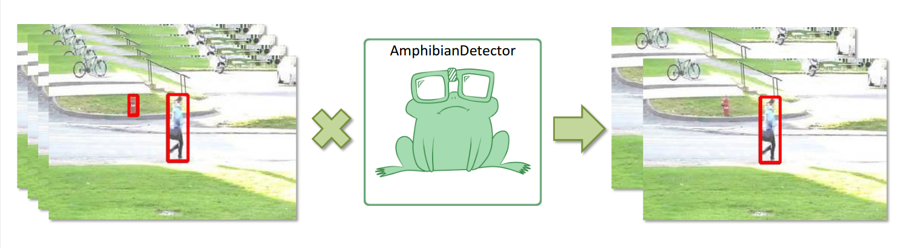
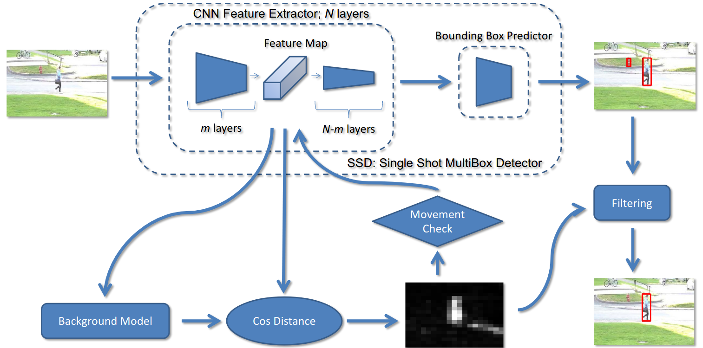

# AmphibianDetector



This repository contains the official implementation of the article: <b>"AmphibianDetector: adaptive computation for moving objects detection"</b>

The proposed approach allows effectively detect moving objects of the target class in a video. It increases mean average precision by filtering out false-positive detections of static objects and reduces the average frame processing time due to adaptive computation - the detector partially process a frame if it does not contain moving target objects.\
The proposed approach is modification of the CNN already trained for object detection task. This method can be used to improve the accuracy of an existing system by applying minor changes to the existing algorithm. The efficiency of the proposed approach was demonstrated on the open dataset "CDNet2014 pedestrian".



### Project structure

  - <b>data_prepare</b> - data preparation, translation of CDNet2014 labels into MS COCO format, augmentation of video frames;
  - <b>models</b> - pretrained models for detection in OD API format. models are downloaded separately from [TF1 detection zoo](https://github.com/tensorflow/models/blob/master/research/object_detection/g3doc/tf1_detection_zoo.md);
  - <b>gridsearch_params.sh & process_cdnet.sh</b> - reproduction of the experiments presented in the article;
  - <b>amphibiandetector_ssd.py</b> - AmphibianDetector method implementation;
  - <b>amphibiandetector_baseline.py</b> - baseline method implementation for the experiments;
  - <b>process_video.py</b> - process one video from the CDNet2014 with the AmphibianDetector;
  - <b>test_stream.py</b> - testing the AmphibianDetector algorithm on a video stream.

### How to run

<b>SSD + MovileNetV2</b>\
To run AmphibianDetector on a video stream:
  1. Download ssd_mobilenet_v2_coco.pb from [TF1 detection zoo](https://github.com/tensorflow/models/blob/master/research/object_detection/g3doc/tf1_detection_zoo.md) and put it in the "models" folder;
  2. Run test_stream.py:
```sh
$ python3 test_stream.py 0
$ python3 test_stream.py ./video.avi
```
 
  
<b>Other models</b>\
To run AmphibianDetector for your model:
  1. Download [CDNet2014 pedestrian] (http://jacarini.dinf.usherbrooke.ca/dataset2014/).
  2. Prepare and augment the dataset using ./data_prepare/cdnet_prepare.sh, ./data_prepare/cdnet_robot_insert.sh and ./data_prepare/cdnet_augment.sh
  3. Using the script ./gridsearch_params.sh find the optimal parameters for your model.


